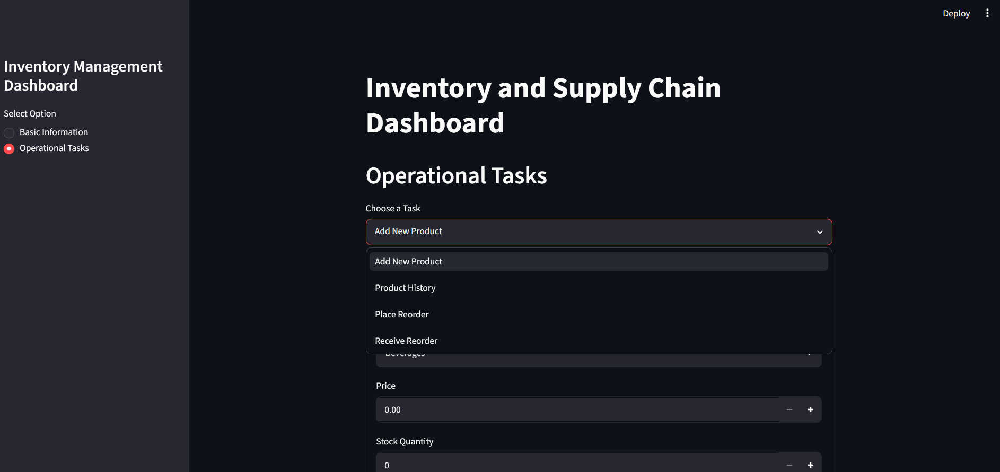
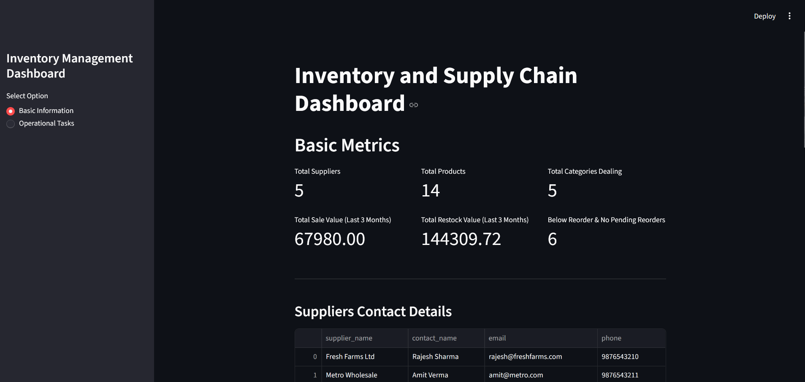

# 🗄️ MySQL Operations Dashboard

> A Python-powered web application built with Streamlit that enables non-technical users to perform advanced database operations on a MySQL backend — no SQL knowledge required.


---
<div style="display: flex; gap: 20px; ">
  <div style="flex: 1; min-width: 45%;">
    
    
  </div>
  <div style="flex: 1; min-width: 45%;">
    
  </div>
</div>

<p align="center">
  
  
</p>


## 📌 Overview

This project simulates a **real-world business operations system** where managers, team leads, and non-technical staff can interact with a MySQL database through a clean, intuitive web interface.

It combines **advanced SQL concepts** (stored procedures, views, functions, triggers) with a **Python Streamlit frontend** — demonstrating full-stack thinking and enterprise-level database design.

---

## 🚀 Features

- 📊 **View & Filter Data** — Browse tables and database views (product lists, order history, inventory levels)
- ⚙️ **Run Stored Procedures** — Execute business operations like *"Mark order as received"* or *"Update stock"* with a single button click
- ➕ **Add / Update Records** — Insert new products, prices, or orders via forms — no SQL needed
- 🧮 **Business Calculations** — Use database functions to check restocking needs, calculate totals, and more
- 📈 **Live Results** — All changes reflect instantly on screen

---

## 🏗️ Project Structure

```
MySQL-Operations-Dashboard-Streamlit/
│
├── app.py                  # Main Streamlit application
├── db_connection.py        # MySQL connection handler
├── requirements.txt        # Python dependencies
│
├── sql/
│   ├── schema.sql          # Database tables & relationships
│   ├── views.sql           # SQL Views for reports
│   ├── procedures.sql      # Stored Procedures
│   └── functions.sql       # SQL Functions
│
└── README.md
```

---

## 🗃️ Database Design

The MySQL database is structured to reflect a real business backend:

| Object | Purpose |
|---|---|
| **Tables** | Products, Orders, Shipments, Inventory |
| **Views** | Product history, Sales summaries, Stock reports |
| **Stored Procedures** | Receive orders, Update inventory, Process shipments |
| **Functions** | Check restock thresholds, Calculate totals |

---

## 🛠️ Tech Stack

| Layer | Technology |
|---|---|
| Frontend | Python, Streamlit |
| Backend | MySQL, MySQL Workbench |
| Connector | mysql-connector-python |
| Language | Python 3.10+ |

---

## ⚙️ Setup & Installation

### Prerequisites
- Python 3.10+
- MySQL Server + MySQL Workbench
- pip

### Steps

**1. Clone the repository**
```bash
git clone https://github.com/your-username/MySQL-Operations-Dashboard-Streamlit.git
cd MySQL-Operations-Dashboard-Streamlit
```

**2. Install dependencies**
```bash
pip install -r requirements.txt
```

**3. Set up the database**

Open MySQL Workbench and run the SQL files in order:
```
sql/schema.sql
sql/views.sql
sql/procedures.sql
sql/functions.sql
```

**4. Configure connection**

In `db_connection.py`, update your credentials:
```python
conn = mysql.connector.connect(
    host="localhost",
    user="root",
    password="your_password",
    database="operations_db"
)
```

**5. Run the app**
```bash
streamlit run app.py
```

---

## 📚 Skills Demonstrated

- ✅ Advanced SQL — Stored Procedures, Views, Functions
- ✅ MySQL database design and normalization
- ✅ Python + MySQL integration using `mysql-connector-python`
- ✅ Real-time web UI development with Streamlit
- ✅ End-to-end full-stack application architecture
- ✅ Simulating real-world business operations systems

---

## 🙋‍♂️ Mohd Farhan Abbas 
      - Currently Interning as Developer Relations (DevRel) @ Y Combinator (YC)
      - Passionate about building real-world applications that bridge the gap
      between complex backend systems and simple, usable interfaces.
      - This project reflects my interest in database engineering, Python
      development, and creating tools that non-technical users can actually use.

- GitHub: [@mohdabbasfarhan](https://github.com/URBANHUNTER107)
- LinkedIn: [Mohd Farhan Abbas](www.linkedin.com/in/mohd-farhan-abbas-704a2b2a8)

---

